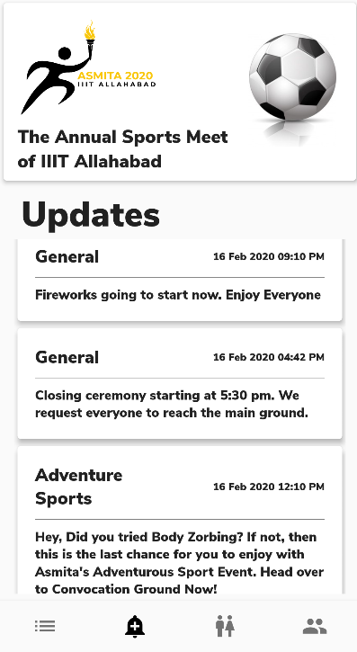
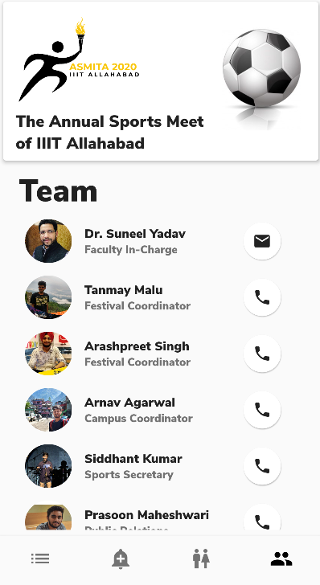
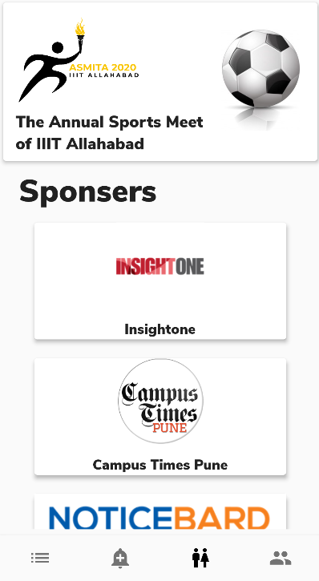

# Asmita'20

## Official mobile application of Asmita - Annual sports fest of IIIT Allahabad.

Stay updated during the event! No need to ask anyone for updates!
Keep fixtures, results sponsors/team details just one tap away. 

### Key features of the app includes:

- Keeps you up to date with ongoing events.
- You can check fixtures and results of any event right in your hand.
- Notifies you about highlights/reschedulings.
- You can contact organiser or team member through the app in case of queries.
- You can also get details of the sponsers of the event.

Here are some screenshots of app made in flutter.

  
  
  

### Authors
- [Ritik Harchani](https://github.com/harchani-ritik)
- [Shreyansh Sahu](https://github.com/23nobody)

Designs of the mobile app made by [Sunidhi Kahsyap](https://www.behance.net/iit2018016065e)